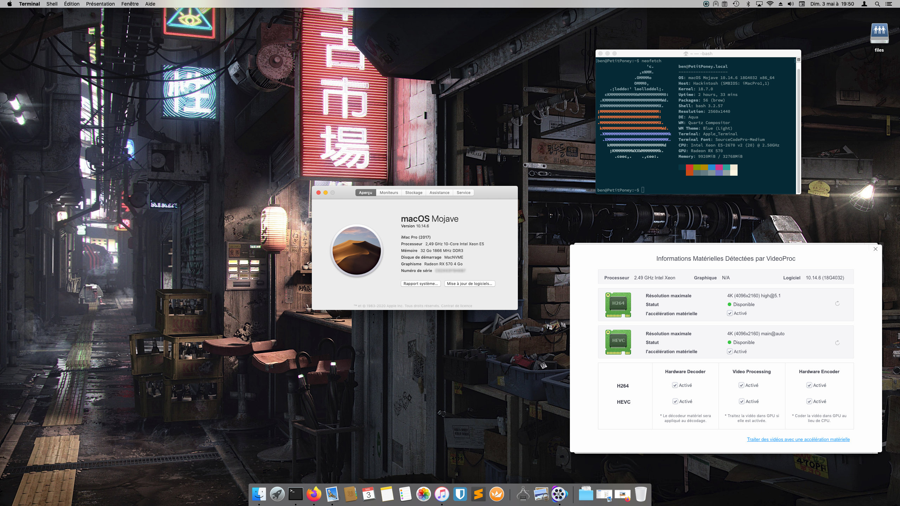

# Hackintosh / MacOS Mojave / Xeon E5-2660 / X79 (PlexHD X79 Turbo V1.03) / Clover

## Configuration
Type|Item|Price
:----|:----|:----
**CPU** | [Intel Xeon E5-2660 2.2 GHz 8-Core OEM/Tray Processor](https://fr.aliexpress.com/item/4000097650923.html) |32€
**Motherboard** | [PLEXHD X79 Turbo LGA2011 ATX](https://aliexpress.com/item/32941784993.html) |62€
**CPU Cooler** | [Noctua NH-D9L 46.44 CFM CPU Cooler](https://pcpartpicker.com/product/8pgPxr/noctua-cpu-cooler-nhd9l) |57€
**Memory** | [Samsung 32GB (4x8GB) DDR3-1333 ECC](https://www.samsung.com/semiconductor/dram/module/M393B1K70CH0-YH9/) |40€
**Video Card** | [Sapphire Radeon RX 570 4 GB NITRO+ Video Card](https://www.ebay.fr/itm/Sapphire-NITRO-Radeon-RX-570-4Gb-GDDR5/114047657582) |80€
**Hard Drive** | [SSD F8 PLUS M.2 2280 PCIE NVME 240 GB](https://www.ldlc.com/fiche/PB00263748.html) |65€
**Case** | [Aerocool AERO-500G RGB ATX Mid Tower Case](https://pcpartpicker.com/product/rcndnQ/aerocool-aero-500g-rgb-atx-mid-tower-case-aero-500g-rgb) |50€
**Power Supply** | [Seasonic M12II EVO 520 SS-520GM2 520W 80+ Bronze EVO Edition](https://www.amazon.com/Seasonic-M12II-520-SS-520GM2-Capacitor/dp/B0038T0V8Q) |76€
:| **Total** | **462€**

## Screenshot
 
